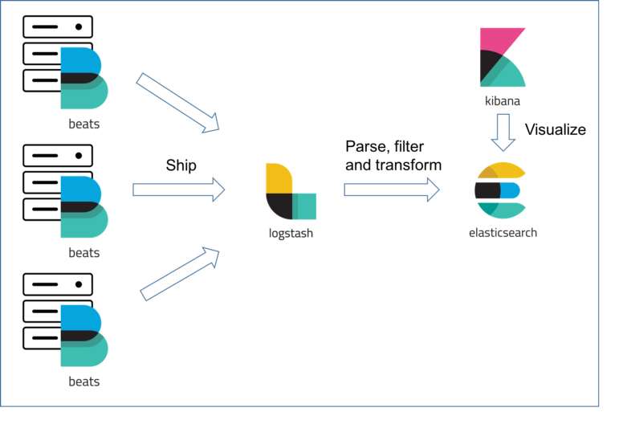

In this document first we will look at the installation and integration of Elk stack and the will explore dockerization.

.. Images

Elkstack Installation and Integration
=====

ELK stack contains

1. **Elastic Serach**, The database
2. **Kibana**, the visualization tool
3. **Logstash**, the Log Aggregation/collection/ Data Parsing and filtering tool (usually suitable at central log collection, to process the logs posted by filebeats.
4. **Filebeats**, The light weight log collection tool (usually suitable at edge devices, just for collecting the logs)

Installation
----

1. Download the compiled binaries for the corresponding srchitecture and OS, using the link (this is for x86_64, Linux) https://artifacts.elastic.co/downloads/elasticsearch/elasticsearch-8.4.3-linux-x86_64.tar.gz

2. Download the compiled binaries for the corresponding srchitecture and OS, using the link (this is for x86_64, Linux) https://artifacts.elastic.co/downloads/kibana/kibana-8.4.3-linux-x86_64.tar.gz

3. Download the compiled binaries for the corresponding srchitecture and OS, using the link (this is for x86_64, Linux) https://artifacts.elastic.co/downloads/logstash/logstash-8.4.3-linux-x86_64.tar.gz

4. Download the compiled binaries for the corresponding srchitecture and OS, using the link 

- for x86_64, Linux https://artifacts.elastic.co/downloads/beats/filebeat/filebeat-8.4.3-linux-x86_64.tar.gz
- for aarch64 (Raspi) https://artifacts.elastic.co/downloads/beats/filebeat/filebeat-8.4.3-linux-arm64.tar.gz

Unzip
----

Unzip all the downloaded tar.gz files using

.. code:: console

  tar -xvzf elasticsearch-8.4.3-linux-x86_64.tar.gz
  tar -xvzf kibana-8.4.3-linux-x86_64.tar.gz
  tar -xvzf logstash-8.4.3-linux-x86_64.tar.gz
  tar -xvzf filebrat-8.4.3-linux-x86_64.tar.gz
  tar -xvzf filebeat-8.4.3-linux-arm64.tar.gz

Start/RUN
----

1. To start Elasticsearch

.. code:: console

  cd <ES_HOME_DIR>
  cd ~/elasticsearch-8.4.2-linux-x86_64/elasticsearch-8.4.2
  # to start elasticsearch
  ./bin/elasticsearch 

The default port for Elstic Search is **port:9200**

.. note::

  This will start the elasticsearch defult on ``localhost`` with security enabled. Durinthe Initial startup It will generate ``password`` for login, default user name is ``elastic`` and a token termed as enrollment key for ``Kibana``. Please copy and save it for later use. These dtails will not appear next start up.

Incase if you get any error while running elasticsearch related to JVM heat memory limits, then run the below command

.. code:: console

  sudo sysctl -w vm.max_map_count=262144

2. To start Kibana, open another bash

.. code:: console

  cd <KIBANA_HOME_DIR>
  cd ~/kibana-8.4.2-linux-x86_64/kibana-8.4.2
  # to start kibana
  ./bin/kibana
  
Now open the browser and enter ``localhost:5601``; the defult port for Kibana is **port:5601**.

It will ask for enrollment key, use the token copied in the previous instance of elasticserach, and click on ``Enroll``.
Once if it is done, it will open a GUI and we will dicsuss more about it later.

.. note::

  Elasticsearch and Kibana will automatically discover each other and requires minimul or no initial configuration

3. Start Logstash, open another bash

.. code:: console

  cd <LOGSTASH_HOME_DIR>
  cd ~/logstash-8.4.2-linux-x86_64/logstash-8.4.2

.. note::

  Elasticsearch and Logstash will not automatically discover each other and requires some initial configuration for Logstash

Logstash Configuration
----
Logstash configuration will have 3 parts

- **Inputs**: From where to read the Log files
- **Filter**: processing to be applied on the collected log before forwarding it to the Elasticsearch
- **Output**: Configuration to connect to elasticsearch

.. note::
 
  Input and Output configuration is must. Filter is optional.

A sample logstash configuration file is given at https://github.com/suresh-iitr/Docker/blob/main/elkstask/logstash/logstash.conf

Logstash can read the filelogs directly or It can collect from ``filebeat``. In our usecase, Logstash, Elastcserach and Kibana are running at VM and the filebeats is running at the edge device. It collects logs and will post to Logstash or the Logstash sitting at VM (central Log Collection and analysis) will collect the logs from multiple Filebeat instances as illustarted in the below figure

|ElK|

Therefore our input plugin for Logstash is filebeat/beats. The defult fort for Logstash is **port:5044**. By default it will start on ``localhost`` only, and will not accept any external beats connection. To accept at all address use host address as **0.0.0.0** 

Usually after processing the collected log, It will be indexed to Elasticsearch. Each differnt index will be an identification to seperate the logs comming from different sources. This is where we need to configure ``output`` section for Logstash and is typically the address of elasticsearch. As we are running Logstash and Elasticserach on the same host, it would be the local host address ``127.0.0.1:9200`` or ``localhost:9200``

**Index** is another important parameter need to specify to identify the logs from different sources. A smple will be ``index => "test-filebeat-%{+YYYY.MM.dd}"``. with this indexing the filename index that will appear in Kibana is ``test-filebeat-2022.10.10``

.. note::

  The ``logstash.conf`` file should be saved to HOME_DIR of Logstash. It doesn't necessarly be the same name, we can use differnt name also.
  
Start Logstash
----
.. code:: console

  # to start Logstash
  ./bin/logstash -f logstash.conf

4. Starting Filebeat

here we are running two different filebeat instances. One instance in the Raspverry pi (act as Edge device), and the another instance in the same host as that of the Logstash (VM) to collect the logs of it's own host. Configuration for the both will be same.

.. code:: console

  cd <FILEBEAT_HOME_DIR>
  cd ~/filebeat-8.4.2-linux-x86_64/filebeat-8.4.2

Similar to Logstash Filebeat also require some configuration before starting. The default file is ``filebeat.yml`` with some default configurations. We need to edit this as per the usecase.

The filebeat requires two important configurations,
1. **Input**: What to collect and from where to collect
2. **Output**: where to send (In our case It would be Logstash)

**Inputs** in our case would be
1. host specific logs that are stored in ``/var/log/*.log`` directory
2. Container logs that are stored in ``/var/lib/docker/containers/*/*-json.log``

.. note::

  To allow the filebeats read access to the docker container logs, Filebeats should be owned by the ``root`` user. If you want only the host logs then no need.
  
- A sample filebeat configuration file ``filebeat.yml`` is given at https://github.com/suresh-iitr/Docker/blob/main/elkstask/filebeat/filebeat.yml

By default in the outputs section elasticsearch would be enabled. Comment out this and uncomment ``Logstash output`` section. For the filebeat instance running at Raspi, the host address should be the ``IP of VM`` for example ``10.12.2.86:5044`` where the logstash is running. For the filebeat instance running on the same host as that of logstash, then the host address can be either the IP or the ``127.0.0.1:5044`` or ``localhost:5044``  

.. code:: console

  # to start filebeat
  # first make the filebeat owner as root if you wants to enable the log collection from docker
  sudo chown root:root filebeat
  sudo chown root:root filebeat.yml
  # to test filebeat configuration for errors
  ./filebeat test config -e
  
  # to start filebeat
  ./filebeat -e -c filebeat.yml
  
  # Now you shoud see some where in the bash output, that connected to ``10.12.2.86:5044``
  
Typical Log Locations
-----

1. for docker ``/var/lib/docker/containers/<contsinerID>/<containerID-json.log``; Every running docker container instance will create json log for that instance.

2. for Host System ``/var/log/``

- this directory contains various log files like ``auth.log`` related to authentication, ``syslog``, ``boot.log`` etc..

3. For NGINX ``/var/log/nginx/access.log`` for access related and ``/var/log/nginx/error.log`` for access errors related.

Dockerization
====

The dockerization structure of this whole elk stack is 
1. Logstash, Elkstack and Kibana are dockerized at attached to the same docker network, to allow sharing 
2. Logstash is exposed to outside at port:5044
3. Elasticsearch is not exposed to outer. Only in the docker network at port:9200
4. Kibana is exposed to outside at port:5061, since we need to access it from outside of the host also.
5. Filebeat is dockerized and allowed to share the Volumes to have access to ``docker container logs and Host logs``. No need to mention any specific port.

create a docker network for sharing among the containers

.. code:: console

  docker network create esk

.. note::

  The following discussion asumes that, we have the unzipped binary directory for all the elk stack tools that we want to dockerize and they are in a directory ``elk`` and the corresponding ``Dockerfile`` is saved in the respective directories for each seperately. We alos assume that the configuration files are also available in the respective locations of the directory for each tool if any.

This reference might ne useful https://logz.io/learn/docker-monitoring-elk-stack/

1. ElasticSerach Dockerization:
-----

The dockerfile for the same is available at https://github.com/suresh-iitr/Docker/blob/main/elkstask/elasticsearch/Dockerfile and the Docker Image for the same is available at ``docker pull suresh-iitr/elasticsearch:latest``

We also need to provide some initial configuration file 

- ``elasticsearch.yml`` https://github.com/suresh-iitr/Docker/blob/main/elkstask/elasticsearch/elasticsearch-sample.yml if you want to continue with the default security enabled

1. build the docker image

.. code:: console

  docker build -t es:v1 .

.. note::

  while running elasticsearch in docker It will not allow to run as root user. so we need to create a user.
  
.. note::

  use of seperate command line for changing the ownership will create another copy of the whole file system and the image size will be twice. So It is recommened to execuite the owner ship at the time of ``COPY`` it self
  
.. code:: console

  COPY --chown=esuser:esuser ./elasticsearch-8.4.2 elasticsearch

2. Run the Image

.. code:: console

  docker run -it --user esuser --name es --net esk es:v1 /bin/bash

3. Initially start the container with default configuration

.. code:: console

  cd elasticsearch
  ./bin/elasticsearch

.. note::

  this will start the elastic serach by default with security enabled
  
4. To start and attach to a running container

.. code:: console
  
  docker start es
  docker exec -it es /bin/bash
  cd elasticsearch
  ./bin/elasticsearch

  

**If you want to disable the security** then stop the elasticsearch using ``Ctrl+C`` and then ``Copy`` the condiguration file https://github.com/suresh-iitr/Docker/blob/main/elkstask/elasticsearch/elasticsearch.yml and then restart.

.. code:: console

  # open another bash
  docker cp <SRC> <ContainerID>:<Dest>
  docker cp ~/elk/search/elasticsearch.yml 2ea3120be98b:/home/esuser/elasticsearch/config/elasticsearch.yml
  # to know container ID run
  docker ps -a
  # to restart
  ./bin/elasticsearch

2. Kibana Dockerization:
-----

The dockerfile for the same is available at https://github.com/suresh-iitr/Docker/blob/main/elkstask/kibana/Dockerfile and the Docker Image for the same is available at ``docker pull suresh-iitr/kibana``

We also need to provide some initial configuration file 

- ``kibana.yml`` https://github.com/suresh-iitr/Docker/blob/main/elkstask/kibana/kibana-sample.yml if you want to continue with the default security enabled

.. note::
  with this configuration, we need to have the enroll token, username and password to integrate kibana with Elasticserach If you are using security enabled.
  
**If you want to disable the security** then you can use ``kibana.yml`` https://github.com/suresh-iitr/Docker/blob/main/elkstask/kibana/kibana.yml

1. build the docker image

.. code:: console

  docker build -t kibana:v1 .
  # to run Kibana Container
  docker run -it --user esuser --name kibana --net esk -p 5601:5601 kibana:v1 /bin/bash
  # to start Kibana
  cd kibana
  ./bin/kibana

2. To start and attach to a running container

.. code:: console
  
  docker start kibana
  docker exec -it kibana /bin/bash
  cd kibana
  ./bin/kibana

3. Logstash Dockerization:
-----

The dockerfile for the same is available at https://github.com/suresh-iitr/Docker/blob/main/elkstask/logstash/Dockerfile and the Docker Image for the same is available at ``docker pull suresh-iitr/logstash``

We also need to provide some initial configuration file 

- ``logstash.conf`` https://github.com/suresh-iitr/Docker/blob/main/elkstask/logstash/Samplelogstash.conf if you want to continue with the default security disabled

- ``logstash.conf`` https://github.com/suresh-iitr/Docker/blob/main/elkstask/logstash/logstash.conf if you want to continue with the default security enabled
  
1. build the docker image

.. code:: console

  docker build -t logstash:v1 .
  # to run logstash Container
  docker run -it --user esuser --name logstash --net esk -p 5044:5044 logstash:v1 /bin/bash
  # to start Logstash
  cd logstash
  ./bin/logstash -f logstash.conf
  

2. To start and attach to a running container

.. code:: console
  
  docker start logstash
  docker exec -it logstash /bin/bash
  cd logstash
  ./bin/logstash -f logstash.conf
  
3. To copy configuration file to running container

.. code:: console

  docker cp ~/elk/logstash/logstash-8.4.2/logstash.conf a9e3275df951:/home/esuser/logstash/logstash.conf  

4. Filebeat Dockerization
----

The dockerfile for the same is available at https://github.com/suresh-iitr/Docker/blob/main/elkstask/filebeat/Dockerfile and the Docker Image for the same is available at ``docker pull suresh-iitr/filebeat`` 

A sample configuration file ``filebeat.yml`` can be found at https://github.com/suresh-iitr/Docker/blob/main/elkstask/filebeat/filebeat.yml

Inorder to allow the contained flebeat to have access to docker logs as well as host logs we will be using the concept of ``Docker Volume``. we have created two directories in the image of filebeat and will mount to the respective source directories while running the container

.. code:: console

  # to build Image
  # the filebeat should be owned by the root user unlike logstash, elasticsearch and Kibana
  docker build -t filebeat:v1 .
  
  # to run the container
  docker run -it --name beats -v /var/lib/docker/containers:/dockerlogs -v /var/log:/hostlogs filebeat:v1 /bin/bash
  
  # incase if you are copying filebeat configuration file to a running container, then after copying change the owner permissions for the same
  chown root:root filebeat.yml
  
  # to start filebeat
  cd filebeat
  ./filebeat -e -c filebeat.yml
  
2. To start and attach to a running container

.. code:: console
  
  docker start filebeat
  docker exec -it filebeat /bin/bash
  cd filebeat
  ./filebeat -e -c filebeat.yml
  
3. To copy configuration file to running container

.. code:: console

  docker cp ~/elk/filebeat/filebeat-8.4.2-linux-x86_64/filebeat.yml c6fd4998b8c2:/filebeat/filebeat.yml

To copy the certificates, key files use ``docker cp`` for the container running on edge device

.. code:: console

  # for the container running on edge device
  docker cp ~/cert/client-pkcs8.key c6fd4998b8c2:/filebeat/client-pkcs8.key
  docker cp ~/cert/client.crt c6fd4998b8c2:/filebeat/client.crt
  docker cp ~/cert/ca.crt c6fd4998b8c2:/filebeat/ca.crt
  
  #for the container running on host device
  docker cp ~/cert/server-pkcs8.key c6fd4998b8c2:/filebeat/server-pkcs8.key
  docker cp ~/cert/server.crt c6fd4998b8c2:/filebeat/server.crt
  docker cp ~/cert/ca.crt c6fd4998b8c2:/filebeat/ca.crt
  
Change the ownerships

.. code:: console

  chown root:root filebeat.yml
  chown root:root ca.crt
  # edge device
  chown root:root client.crt
  chown root:root client-pkcs8.key
  # Same host device
  chown root:root server.crt
  chown root:root server-pkcs8.key
  
  # to check for ownership
  ls -la
  
Secure Communication b/w Filebeat & Elastic Search
====

Till now we have explored about the integration of elasticstack, now we will explore the security acpects.

1. From every ``filebeat`` instance represting a signle edge node, to Logstash at VM, the communication should be over HTTPS. The default version is ``TLSv1.2``.
2. From Logstash to Elasticsearch, No TLS is Imposed, Since Elasticsearch is not getting exposed outside.
3. From Elasticsearch to Kibana also NO TLS is imposed.
4. Kibana will be exposed to outside so we need to impose TLS.

to use TLS/SSL we need to generate the ``Certificate`` and ``Keys``.

Certifcate and Key Generation
-----
Reference: http://www.steves-internet-guide.com/mosquitto-tls/

**Overview of Steps**
1. Create a CA key pair

.. code:: console

  openssl genrsa -des3 -out ca.key 2048
  # -des3 flag will generate a password protected Key

2. Create CA certificate and use the CA key from step 1 to sign it.

.. code:: console

   openssl req -new -x509 -days 1826 -key ca.key -out ca.crt

3. Create a Server key pair for Logstash Server ``don’t password protect``

.. code:: console

   openssl genrsa -out server.key 2048
   
4. Create a Server certificate request using key from step 3

.. code:: console

   openssl req -new -out server.csr -key server.key

5. Use the CA certificate to sign the Server certificate request from step 4.

.. code:: console

   openssl x509 -req -in server.csr -CA ca.crt -CAkey ca.key -CAcreateserial -out server.crt -days 360

6. Create a Client key pair for filebeat instance ``don’t password protect``

.. code:: console

   openssl genrsa -out client.key 2048
   
7. Create a Client certificate request using key from step 3

.. code:: console

   openssl req -new -out client.csr -key client.key

8. Use the CA certificate to sign the Client certificate request from step 7.

.. code:: console

   openssl x509 -req -in client.csr -CA ca.crt -CAkey ca.key -CAcreateserial -out client.crt -days 360
   
9. Now we should have a CA key file, a CA certificate file, a Server key file, A Server Certificate file, Client key file and a client certificate file.
10. Copy ``ca.crt``, ``server.crt`` and ``server.key`` to logstash docker instance  
11. Copy ``ca.crt``, ``client.crt`` and ``client.key`` to filebeat docker instance

Securing the Communication
-----

Ref: https://www.elastic.co/guide/en/beats/filebeat/current/configuring-ssl-logstash.html

Ref: https://www.linode.com/docs/guides/secure-logstash-connections-using-ssl-certificates/

refer to the ``logstash.conf`` and ``filebeat.yml`` for the configuration changes required for to impose SSL/TLS and also ``x.509 Certificate based Authentication``.

.. note::

  x.509 certificate based authetication will works fine for LAN. But the applicability of the same in external communication is queston mark? since the client certificate will be generated for the private address and the actual public facing address will be different.

Elastic stack supports the keys in pkcs8 format only. to convert the server.key and client.key in to this format use

.. code:: console

  openssl pkcs8 -in server.key -topk8 -out server-pkcs8.key -nocrypt
  
  openssl pkcs8 -in client.key -topk8 -out client-pkcs8.key -nocrypt
  
Enable Security in Kibana
-----

To enable security mean SSL/TLS in Kibana since it is getting exposed to outside, add the belllow lines to the ``kibana.yml`` file

.. code:: console

  server.ssl.enabled: true
  server.ssl.certificate: "/home/esuser/kibana/config/server.crt"
  server.ssl.key: "/home/esuser/kibana/config/server-pkcs8.key"
  # these lines by default present in the kibana.yml file with commented out.
  # just uncomment them and provide the paths.
  
.. note::

  It is recommened to save the server.key and server-pkcs8.key in the ``config`` directory of kibana
  
We can ues the same server.crt and server-pkcs8.key generated for Logstash, since both are running on the same host.

To copy the configuration files and the certificates, key files use ``docker cp``

.. code:: console

  docker cp ~/cert/server-pkcs8.key 32fa520f28c8:/home/esuser/kibana/config/server-pkcs8.key
  docker cp ~/cert/server.crt 32fa520f28c8:/home/esuser/kibana/config/server.crt
  docker cp ~/elk/kibana/kibana-8.4.2/config/kibana.yml 32fa520f28c8:/home/esuser/kibana/config/kibana.yml
  
The configuration file with the corresponding changes can be found at https://github.com/suresh-iitr/Docker/blob/main/elkstask/kibana/kibanaSSL.yml

while dockerizing the ELK stack
1. First start the elsticsearch container with default configfile
docker run -it --name elasticsearch --net elk -p 9200:9200 -p 9300:9300 --user esuser -m 1GB -e "discovery.type=single-node" elasticsearch:8.10.2
with some changes in the default parameters in the elasticsearch.yml file.
excluding the security.

Then start the elasticsearch instance: ./elasticsearch/bin/elasticserach

then ctrl+c after token generated

Now make the modifications in elasticserach.yml file to disable the security features
make sure all the parameters related to security are set to false

xpack.security.enabled: false

xpack.security.enrollment.enabled: false
xpack.security.http.ssl:
  enabled: true
xpack.security.transport.ssl:
  enabled: false

Then copy this config file to the docker instance
docker cp ~/elasticsearch/elasticsearch.yml elasticsearch:/home/esuser/elasticsearch/config/elasticsearch.yml

then restart the elsticsearch using ./elasticsearch/bin/elasticserach

2. Now start the kibana instance
docker run -it --name kibana --net elk -p 5601:5601 --user esuser kibana:8.10.2

in the config file kibana.yml, do the initial modifications 
server.port: 5601
server.host: "0.0.0.0"
elasticsearch.hosts: ["http://elasticsearch:9200"]
elasticsearch.ssl.verificationMode: none
These are the major changes to do. copy the modified file to kibana container

docker cp ~/kibana/kibana-8.10.2/config/kibana.yml kibana:/home/esuser/kibana/config/kibana.yml

start the kibana instance using ./kibana/bin/kibana

goto browser and open localhost:5601/

3. now we can exist from the two containers and then again restart the containers
4. Logstash is alo started in the same manner as the above

docker run -it --name logstash --user esuser --net elk -p 5044:5044 logstash:8.10.2 

* things to remember for Logstash is 
- it requires a logstash.conf file which has to be located in home directory of the logstash 
means /home/esuser/logstash/logstash.conf
this mainly contains the Input and Output plugin configurations

- to run the logstash use /home/esuser/logstash/bin/logstash -f logstash.conf

5. Filebeats setup.
all the files must be owned by the root user.
I could collect the auth.log using the input plugin filestream
and providing the path: 
paths:
    - /var/log/auth.log

the destination can be Logstash  "raspberrypi1.local:5044"

use sudo ./filebeat -e c filebeat.yml  to run the filebeat instance

6. Now we will explore how to collect syslog log using filebeats.

sudo apt list -a rsyslog  # to check is rsyslog installed?
sudo service rsyslog status   # to know the status

This command listed syslog.socket created at /run/systemd/journal/syslog

The example configuration given in Elastic docs

filebeat.inputs:
- type: syslog
  format: auto
  protocol.unix:
    path: "/path/to/syslog.sock"

sudo ./filebeat test config -e

sudo ./filebeat -e -c filebeat.yml

filebeat.inputs:
- type: filestream
id: my-filestream-id
enabled: true
paths:
  - /var/log/syslog
tags: [piBeats]

output.console:
enabled: true
pretty: true

